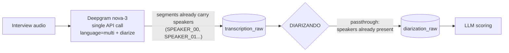
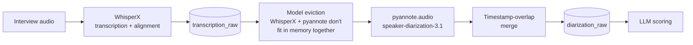

# AI Interview Scorecard Pipeline

[](https://github.com/luccapinto/scorecard-pipeline/actions/workflows/ci.yml)
[](https://www.python.org/)
[](https://opensource.org/licenses/MIT)
[](https://github.com/luccapinto/scorecard-pipeline/actions/workflows/codeql.yml)

📖 **[Leia em português](README.md)** — the Portuguese README is the primary and
most detailed document; this page is a condensed English overview.

---

## What it does

A pipeline that turns a recorded technical interview into a **structured,
evidence-backed scorecard** for hiring decisions. Each recording is processed
individually — no polling, no batching.

```
Webhook → Transcription → Diarization → Scoring (LLM) → Human approval
```

Every claim in the generated scorecard is checked back against the transcript
(exact plus fuzzy matching), so a hallucinated quote is caught before a human
ever reads it.

**Human decision is required.** The pipeline produces a recommendation and
stops at `AGUARDANDO_APROVACAO` (awaiting approval); it never auto-rejects or
auto-approves a candidate.

## Architecture

| Component | Technology |
|---|---|
| API | FastAPI + Uvicorn |
| Queue | Redis + RQ, with timeout and retry policy |
| State | PostgreSQL (SQLModel, JSONB) + Alembic migrations |
| Transcription | Deepgram nova-3 (default) / WhisperX (local) / OpenAI whisper-1 |
| Diarization | Native in Deepgram mode; pyannote.audio otherwise |
| Scoring | OpenRouter with JSON-schema structured outputs, `temperature=0` |
| Evidence check | Exact plus fuzzy matching (RapidFuzz), WER-tolerant |

The interview state machine is durable: each stage checkpoints its result, so a
failed job resumes from where it stopped rather than reprocessing from scratch.

### Dual architecture: transcription and diarization

The `TRANSCREVENDO` and `DIARIZANDO` stages are identical in the state machine,
but what happens inside them depends on `TRANSCRIPTION_PROVIDER`:

**API mode (`deepgram`, default)** — one call handles both transcription and
diarization; the diarization stage becomes a passthrough over the persisted
data. No local models, no GPU, no `HF_TOKEN`:



**Local mode (`local`)** — everything runs on your own infrastructure; no audio
leaves it. WhisperX transcribes and aligns timestamps, pyannote detects
speakers, and a timestamp-overlap merge attributes each utterance:



The passthrough is decided from the **persisted data** (segments carrying a
`speaker` key), not the current config — an interview resumed after a provider
switch keeps behaving consistently.

## Transcription providers

Transcription and diarization are pluggable via `TRANSCRIPTION_PROVIDER`:

| Provider | Transcription | Diarization | Requirements | Cost (~1h audio) | Time (~1h audio) |
|---|---|---|---|---|---|
| `deepgram` (**default**) | Deepgram nova-3 | **Native, same call** | `DEEPGRAM_API_KEY` | ~US$0.31 | ~1–2 min |
| `local` | WhisperX | pyannote.audio | `requirements-ml.txt` + `HF_TOKEN` | free (own compute) | ~15 min+ on CPU |
| `openai` | whisper-1 | pyannote.audio (local) | `OPENAI_API_KEY` + local ML | ~US$0.36 + compute | hybrid |

In `deepgram` mode the transcription segments already carry speaker labels, so
the diarization stage becomes a passthrough — detected from the persisted data
rather than the current config, so interviews resumed after a provider switch
behave consistently.

**Gotchas learned empirically:**

- `DEEPGRAM_LANGUAGE` is mandatory. Deepgram defaults to English and returns an
  **empty transcript** (while still billing) on a language mismatch.
- Use `multi` (code-switching), not `pt`. The monolingual mode drops the English
  technical vocabulary embedded in Portuguese speech — exactly the words scoring
  and evidence validation depend on.
- OpenRouter exposes a transcription endpoint that serves nova-3, but its
  normalized response schema **discards speaker labels**, which is why this
  project talks to the Deepgram API directly.

Validated against a real 53-minute Portuguese technical interview: transcription
plus diarization in 68 seconds (~US$0.28), with three speakers correctly
separated.

## Quickstart

```bash
# Full stack (Postgres, Redis, API with migrations, worker, web UI)
cp .env.example .env      # fill in DEEPGRAM_API_KEY and OPENROUTER_API_KEY
docker compose up -d --build
```

Or run the app locally against containerized infrastructure:

```bash
docker compose up -d postgres redis
python -m venv .venv && source .venv/bin/activate
pip install -r requirements-dev.txt
alembic upgrade head

python run_worker.py                              # terminal 1
python -m uvicorn app.main:app --reload           # terminal 2
```

The worker validates at startup that the configured provider can actually run
and fails immediately with a clear message otherwise — it never processes
interviews with fabricated data.

Interactive API docs: `http://localhost:8000/docs`.

## Configuration

All settings are environment variables, documented in
[`.env.example`](.env.example). The ones that matter most in production:

| Variable | Why it matters |
|---|---|
| `WEBHOOK_HMAC_SECRET` | Verifies webhook signatures. Empty disables verification (dev only). |
| `API_KEY` | Required on read/action endpoints. Empty disables auth (dev only). |
| `AUDIO_ALLOWED_DIR` | Restricts local recording paths. Empty accepts any path (dev only). |
| `RETENTION_DAYS` | Purges terminal-state interviews. **Defaults to `0`, which disables purging.** |

## Testing

```bash
ruff check .        # lint
mypy                # type check
pytest              # full suite
pytest --cov=app --cov-report=term-missing --cov-fail-under=78
pip-audit -r requirements.txt --strict
```

The suite runs **without** the heavy ML backends — those imports are stubbed
deterministically, so contributors do not need torch to contribute.

## Web UI

`frontend/dist/` holds a **pre-built** React SPA served by nginx at
`http://localhost:5173`.

> ⚠️ **Known limitation:** only the compiled bundle is versioned; the SPA source
> is not part of this repository, so the interface cannot be audited, modified
> or rebuilt from a clone. It is a convenience artifact for demonstrating the
> pipeline, not a maintained component. The API is the system's contract and is
> fully usable without it. Publishing the UI source — or replacing it with an
> open alternative — is a welcome contribution.

## Privacy and responsible use

This pipeline processes **recordings and personal data of job candidates**, and
it scores people. A few things are deliberate:

- The scoring stage validates every piece of evidence against the transcript to
  limit hallucinated justifications.
- A human always makes the final call.
- Depending on the provider, audio is sent to a third party. Use
  `TRANSCRIPTION_PROVIDER=local` to keep everything on your own infrastructure.
- Retention purging exists but is **off by default** — configure
  `RETENTION_DAYS` before processing real data.

See [SECURITY.md](SECURITY.md) for the threat model and reporting process.

## Contributing

See [CONTRIBUTING.md](CONTRIBUTING.md) for setup, workflow and style, and
[CODE_OF_CONDUCT.md](CODE_OF_CONDUCT.md) for community expectations. The project
follows Spec Driven Development: substantial changes start with a spec under
`docs/specs/`, and architectural decisions are recorded as ADRs in `docs/adr/`.

## License

[MIT](LICENSE)
