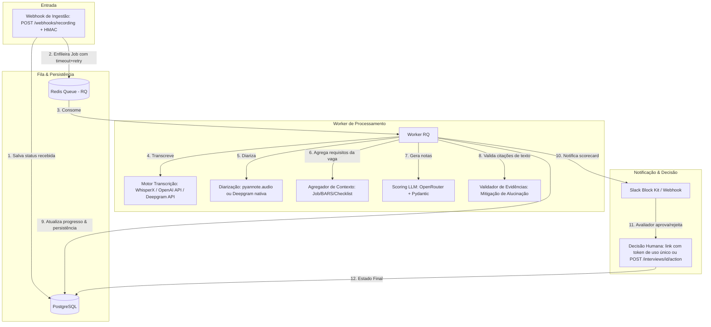
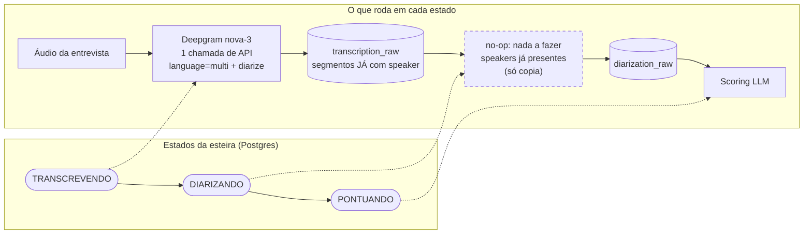
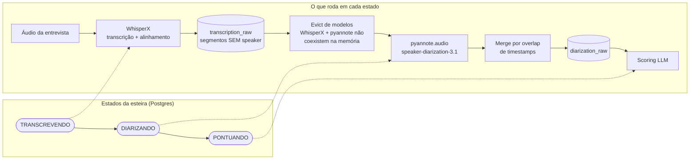

# Pipeline de Scorecard de Entrevistas com IA

[](https://github.com/luccapinto/scorecard-pipeline/actions/workflows/ci.yml)
[](https://www.python.org/)
[](https://opensource.org/licenses/MIT)
[](https://github.com/luccapinto/scorecard-pipeline/actions/workflows/codeql.yml)

📖 **[Read this in English](README.en.md)**

Transforma a gravação de uma entrevista técnica em um **scorecard estruturado e
baseado em evidências verificadas**. Cada citação usada para justificar uma nota
é conferida contra a transcrição (matching exato + fuzzy) antes de chegar a um
humano — e a decisão final é **sempre humana**: a esteira para em
`aguardando_aprovacao` e nunca aprova ou rejeita um candidato sozinha.

A transcrição e a diarização têm **arquitetura dupla**: rodam inteiramente
**locais** (WhisperX + pyannote, sem enviar áudio a terceiros) ou **via API**
(Deepgram nova-3, padrão — uma chamada resolve as duas etapas). A troca é uma
variável de ambiente; a esteira, a máquina de estados e o scoring não mudam.

## 📑 Sumário

- [Arquitetura do Sistema](#%EF%B8%8F-arquitetura-do-sistema)
- [Stack Tecnológica](#%EF%B8%8F-stack-tecnológica)
- [Decisões de Arquitetura (ADRs)](#-decisões-de-arquitetura-adrs)
- [Estrutura de Diretórios](#-estrutura-de-diretórios)
- [Como Executar Localmente](#-como-executar-localmente)
- [Interface Web](#%EF%B8%8F-interface-web)
- [Validando o Fluxo de Ponta a Ponta](#-validando-o-fluxo-de-ponta-a-ponta)
- [Transcrição & Diarização — Provedores](#%EF%B8%8F-transcrição--diarização--provedores)
- [Benchmark WER](#-relatório-de-benchmark-wer)
- [Testes](#-executando-a-suíte-de-testes)
- [Contribuindo](#-contribuindo)
- [Licença](#-licença)

## 🏗️ Arquitetura do Sistema

O pipeline é projetado para processar cada gravação de entrevista individualmente, sem polling periódico e sem loteamento.



### Máquina de Estados

```
recebida → transcrevendo → diarizando → pontuando → aguardando_aprovacao → aprovada | rejeitada
                 ↘             ↘            ↘
                              falhou  (reprocessável via POST /interviews/{id}/reprocess)
```

Cada etapa persiste um checkpoint (`transcription_raw`, `diarization_raw`, `scorecard`);
uma entrevista que falhou retoma exatamente do ponto onde parou, sem repetir
transcrição/diarização já concluídas. Jobs são enfileirados com `job_timeout`
dimensionado para áudios longos e retry automático com backoff.

### Arquitetura dupla: transcrição e diarização

As etapas `TRANSCREVENDO` e `DIARIZANDO` são as mesmas na máquina de estados,
mas o trabalho interno depende do `TRANSCRIPTION_PROVIDER`:

> **Leia os diagramas assim:** `TRANSCREVENDO` e `DIARIZANDO` (nas faixas
> superiores) são **estados da esteira**, persistidos no Postgres — não são
> trabalho. Eles existem igualmente nos dois modos; o que muda é o que roda
> dentro de cada um, mostrado na faixa inferior. Manter os mesmos estados é
> proposital: o checkpoint de retomada, o status exposto pela API e o contrato
> lido pelo scoring não dependem do provider escolhido.

**Modo API (`deepgram`, padrão)** — uma única chamada resolve transcrição e
diarização. A entrevista **ainda passa pelo estado `DIARIZANDO`**, mas ali não
roda nenhum modelo nem nova chamada: os speakers já estão nos segmentos, e a
etapa apenas os grava em `diarization_raw`. Sem modelos locais, sem GPU, sem
`HF_TOKEN`:



**Modo local (`local`)** — tudo roda na sua infraestrutura; nenhum áudio sai
dela. Aqui o estado `DIARIZANDO` faz trabalho de verdade: pyannote detecta os
speakers e um merge por sobreposição de timestamps atribui cada fala:



**Por que o modo API não pula o estado?** Porque os estados são o mecanismo de
durabilidade da esteira, e mantê-los idênticos entre providers dá três coisas:
uma entrevista que falhou retoma de `DIARIZANDO` e encontra `diarization_raw`
gravado, independentemente de quem o produziu; o status exposto pela API não
vaza qual provider está configurado; e o scoring lê sempre `diarization_raw`,
sem caminho alternativo. O custo é uma duplicação de dados no modo API
(`transcription_raw` e `diarization_raw` ficam quase idênticos) — barato para
o volume de uma entrevista, e o preço de manter uma esteira só em vez de duas.

A decisão de fazer o no-op é tomada **pelos dados persistidos** (segmentos que
já trazem a chave `speaker`), não pela configuração vigente — uma entrevista
retomada após troca de provider continua se comportando corretamente.
Comparação de custo, tempo e requisitos de cada modo na seção
[Transcrição & Diarização](#%EF%B8%8F-transcrição--diarização--provedores).

---

## 🛠️ Stack Tecnológica

- **Core & API:** Python 3.11 + FastAPI (Uvicorn)
- **Fila de Mensageria:** Redis + RQ (Redis Queue) com timeout e retries configurados
- **Persistência de Estado:** PostgreSQL (SQLAlchemy / SQLModel, JSONB) + Alembic (migrações)
- **Transcrição (STT):** Deepgram nova-3 (Nuvem, **default**, com diarização nativa) / WhisperX (Local) / OpenAI API (Nuvem)
- **Diarização (Speakers):** nativa no modo Deepgram (default); Pyannote.audio (`pyannote/speaker-diarization-3.1`) nos modos local/openai
- **Motor de Scoring:** OpenRouter (structured outputs JSON Schema derivado de Pydantic, `temperature=0`)
- **Validação de Evidência:** matching exato + fuzzy (RapidFuzz) tolerante a WER real
- **Geração de Dados Sintéticos:** `edge-tts` (TTS multi-voz Azure) + Templates de Vaga estruturados
- **Notificações:** Slack Webhook (Block Kit) com links de decisão por token de uso único + Webhook Genérico HTTP
- **Segurança:** HMAC no webhook de ingestão, API key nos endpoints, guarda anti-SSRF no download de áudio
- **Containerização:** Docker + Docker Compose (API + worker + Postgres + Redis)

---

## 📖 Decisões de Arquitetura (ADRs)

Documentamos detalhadamente as principais escolhas técnicas do projeto através de Architecture Decision Records (ADRs):

1. **[ADR 0001 — Fila vs. Polling](docs/adr/0001-fila-vs-polling.md):** Uso de arquitetura orientada a eventos com Redis Queue frente a consultas periódicas.
2. **[ADR 0002 — Lookup Determinístico vs. RAG](docs/adr/0002-lookup-deterministico-vs-rag.md):** Por que optamos por lookup de arquivos locais de vagas em vez de buscas semânticas vetoriais para montagem do prompt.
3. **[ADR 0003 — Escolha de Fila Simples (RQ) vs. Celery](docs/adr/0003-rq-vs-celery.md):** Balanceamento de complexidade e robustez com RQ.
4. **[ADR 0004 — Risco de Viés em Avaliação de Cultura](docs/adr/0004-avaliacao-cultura-fit-bias.md):** Mitigações éticas baseadas em âncoras BARS, evidências literais obrigatórias e validação humana mandate.

Há também uma revisão completa de arquitetura em [docs/reviews/](docs/reviews/).

---

## 📂 Estrutura de Diretórios

```text
├── app/
│   ├── main.py            # FastAPI Webhooks, decisão humana, health e admin
│   ├── models.py          # Tabela Interview e máquina de estados (inclui FALHOU)
│   ├── database.py        # Conexão e sessão do PostgreSQL / SQLite
│   ├── config.py          # Configurações de variáveis de ambiente (Pydantic Settings)
│   ├── queue.py           # Conexão com Redis Queue + política de timeout/retry
│   ├── tasks.py           # Orquestração resiliente da esteira do Worker (com lock)
│   ├── audio_processor.py # Drivers WhisperX (local), OpenAI e Deepgram (nuvem) e Pyannote (com cache de modelos)
│   ├── scoring.py         # Contexto, OpenRouter (structured outputs) e validador de evidência fuzzy
│   ├── notifications.py   # Slack Block Kit e Webhook genérico com links de decisão por token
│   ├── security.py        # Verificação HMAC do webhook e API key
│   ├── maintenance.py     # Reconciliação de entrevistas órfãs e retenção (LGPD)
│   ├── logging_config.py  # Logging estruturado com correlation id (interview_id)
│   ├── text_utils.py      # Normalização de texto compartilhada
│   └── schemas.py         # Validação Pydantic (Vagas, checklists e scorecards)
├── alembic/               # Migrações de schema versionadas
├── data/
│   └── synthetic/         # JSONs de vaga e áudios de teste gerados sinteticamente
├── docs/
│   ├── adr/               # Architecture Decision Records (ADRs)
│   ├── reports/           # Relatório comparativo de Word Error Rate (WER)
│   ├── reviews/           # Revisões de arquitetura
│   └── specs/             # Especificações de design SDD (Spec Driven Development)
├── scripts/
│   ├── generate_synthetic.py  # Script CLI gerador de TTS e vaga para testes locais
│   └── run_benchmark.py       # Script CLI comparador de WER entre provedores
├── tests/                 # Suíte de testes (pytest)
├── Dockerfile             # Imagem da API e do worker
├── docker-compose.yml     # Stack completa: Postgres, Redis, API e worker
├── requirements.txt       # Dependências de produção
├── requirements-dev.txt   # Dependências de desenvolvimento/teste
├── requirements-ml.txt    # Backends ML pesados (WhisperX, pyannote)
└── run_worker.py          # Worker RQ com validação fail-fast de dependências
```

---

## 🚀 Como Executar Localmente

### 1. Pré-requisitos
- Docker instalado na máquina.
- Python 3.11 instalado localmente.

### 2. Configurando o Ambiente
Copie o arquivo `.env.example` para `.env`:
```bash
cp .env.example .env
```
Preencha as variáveis conforme necessário:
- `DEEPGRAM_API_KEY`: Chave da Deepgram para o provider default de transcrição + diarização (nova-3). Veja a seção *Transcrição & Diarização* abaixo.
- `OPENROUTER_API_KEY`: Chave para o motor de Scoring (LLM).
- `HF_TOKEN`: Token do Hugging Face com acesso ao `pyannote/speaker-diarization-3.1` — **apenas** para os providers `local`/`openai`.
- `OPENAI_API_KEY`: apenas para `TRANSCRIPTION_PROVIDER=openai`.
- `SLACK_WEBHOOK_URL` (Opcional): Para testar notificações no Slack.
- **Em produção, sempre defina:** `WEBHOOK_HMAC_SECRET` (assinatura do webhook), `API_KEY` (auth dos endpoints) e `AUDIO_ALLOWED_DIR` (restringe caminhos locais de áudio).

### 3. Opção A — Stack completa com Docker Compose
```bash
docker compose up -d --build
```
Sobe Postgres, Redis, a API (com migrações aplicadas automaticamente) e o worker
(imagem com os backends ML instalados via `INSTALL_ML=true`).

### 3. Opção B — Infra no Docker, app local
```bash
docker compose up -d postgres redis
python -m venv .venv && source .venv/bin/activate
pip install -r requirements-dev.txt
# Backends ML locais (WhisperX + pyannote — pesado, requer torch):
pip install -r requirements-ml.txt
```

### 4. Aplicando as Migrações de Banco
O schema é gerenciado pelo Alembic (a API não cria tabelas no startup):
```bash
alembic upgrade head
```

### 5. Dataset Sintético de Teste
O repositório já inclui em `data/synthetic/` os arquivos JSON (vaga, competências
BARS, checklist e roteiro de diálogo) de **três perfis de entrevista realistas**,
cobrindo todo o espectro de avaliação:

| Perfil | Vaga | Candidato | Resultado esperado |
|---|---|---|---|
| `python_pleno` | Desenvolvedor Python Pleno | Forte (métricas concretas, incidente real, boas práticas) | Aprovado |
| `dados_senior` | Engenheiro de Dados Sênior | Misto (forte em pipelines/Spark, fraco em streaming) | Próxima Etapa |
| `frontend_junior` | Frontend Júnior (React) | Fraco (respostas vagas, conceitos confundidos) | Rejeitado |

Para gerar os áudios `.wav` multi-voz (requer acesso à internet para o TTS):
```bash
python scripts/generate_synthetic.py                       # todos os perfis
python scripts/generate_synthetic.py --profile dados_senior  # um perfil específico
python scripts/generate_synthetic.py --skip-audio          # apenas regenerar os JSONs
```

### 6. Executando o Worker RQ e o Servidor Web
Abra dois terminais (com o ambiente virtual ativo):

**Terminal 1 (Worker):**
```bash
python run_worker.py
```
O worker valida na inicialização que o provider configurado é executável
(whisperx/pyannote instalados, chaves definidas) e falha imediatamente com uma
mensagem clara caso contrário — nunca processa com dados simulados.

**Terminal 2 (API FastAPI):**
```bash
python -m uvicorn app.main:app --reload
```

---

## 🖥️ Interface Web

O diretório `frontend/` contém o **código-fonte** de uma SPA React + TypeScript
que funciona como painel da esteira: resumo de entrevistas por estágio,
destaque das que precisam de ação humana (`aguardando_aprovacao` e `falhou`),
scorecard com alerta visual para evidências não verificadas (possível
alucinação do LLM), transcrição separada por interlocutor e o fluxo de
aprovação/rejeição com confirmação em duas etapas.

- **No Docker Compose** a SPA é construída do source (multi-stage Node → nginx)
  e servida em `http://localhost:5173`, origem que já está na allowlist de
  CORS da API.
- **Em desenvolvimento**: `cd frontend && npm install && npm run dev` (a porta
  5173 é obrigatória — a allowlist de CORS depende dela).
- A URL da API e a `X-API-Key` são configuráveis **em runtime** pela própria
  interface (persistidas no `localStorage` do navegador) — nenhuma chave ou
  host é embutido no build.
- Como rodar, buildar e testar: veja [`frontend/README.md`](frontend/README.md).

A API continua sendo a interface de contrato do sistema e é completamente
utilizável sem a SPA (veja a validação de ponta a ponta abaixo e a documentação
interativa em `http://localhost:8000/docs`).

---

## 🧪 Validando o Fluxo de Ponta a Ponta

### 1. Disparando a Ingestão (Webhook)
```bash
curl -X POST http://127.0.0.1:8000/webhooks/recording \
  -H "Content-Type: application/json" \
  -d '{
    "recording_url": "data/synthetic/interview_python_pleno.wav",
    "job_id": "python_pleno",
    "external_id": "gravacao-001"
  }'
```
O webhook retorna HTTP `202 Accepted` com o ID da entrevista. `external_id` é a
chave de idempotência: um webhook reenviado com o mesmo valor retorna a
entrevista existente em vez de criar duplicata. Com `WEBHOOK_HMAC_SECRET`
definido, envie também o header `X-Webhook-Signature` (HMAC-SHA256 do corpo).

### 2. Consultando o Status da Entrevista
```bash
curl -H "X-API-Key: $API_KEY" http://127.0.0.1:8000/interviews/{INTERVIEW_ID}
```
Assim que o status atingir `aguardando_aprovacao`, a notificação terá sido
disparada com links de decisão de uso único. Se o processamento falhar, o
status fica `falhou` com o erro em `error_log`.

### 3. Decisão Humana
Pelos botões da notificação (link GET com token de uso único), ou via API:
```bash
curl -X POST http://127.0.0.1:8000/interviews/{INTERVIEW_ID}/action \
  -H "Content-Type: application/json" -H "X-API-Key: $API_KEY" \
  -d '{"action": "approve"}'
```

### 4. Operação
```bash
curl http://127.0.0.1:8000/health                                  # liveness de DB e Redis
curl -X POST -H "X-API-Key: $API_KEY" \
  http://127.0.0.1:8000/interviews/{INTERVIEW_ID}/reprocess        # reprocessa entrevista 'falhou'
curl -X POST -H "X-API-Key: $API_KEY" \
  http://127.0.0.1:8000/admin/reconcile                            # re-enfileira 'recebida' órfãs
python -m app.maintenance                                          # reconciliação + retenção via cron
```

---

## 🎙️ Transcrição & Diarização — Provedores

A etapa de transcrição/diarização é plugável via `TRANSCRIPTION_PROVIDER`:

| Provider | Transcrição | Diarização | Requisitos | Custo (~1h de áudio) | Tempo (~1h de áudio) |
|---|---|---|---|---|---|
| `deepgram` (**default**) | Deepgram nova-3 (API) | **Nativa, na mesma chamada** | `DEEPGRAM_API_KEY` | ~US$ 0,31 (`multi`) | ~1–2 min |
| `local` | WhisperX (CPU/GPU) | pyannote.audio | `requirements-ml.txt` + `HF_TOKEN` | zero (compute próprio) | ~15 min+ em CPU |
| `openai` | whisper-1 (API) | pyannote.audio (local) | `OPENAI_API_KEY` + ML local + `HF_TOKEN` | ~US$ 0,36 + compute | híbrido |

No modo `deepgram`, os segmentos já chegam rotulados por speaker (`SPEAKER_00`,
`SPEAKER_01`, ... — mesmo formato do pyannote) e a etapa `DIARIZANDO` da esteira
vira um passthrough: a detecção é feita **pelos dados persistidos** (segmentos com
chave `speaker`), então entrevistas retomadas após troca de provider se comportam
corretamente. O worker também dispensa whisperx/pyannote/HF_TOKEN no startup
nesse modo.

**Gotchas do provider `deepgram` (aprendidos empiricamente):**
- `DEEPGRAM_LANGUAGE` é obrigatório: o default da Deepgram é inglês e, com
  idioma errado, a API retorna transcript **vazio** (e cobra mesmo assim).
- Use `multi` (code-switching, default deste repo), não `pt`: o modo monolíngue
  derruba/mangla os termos técnicos em inglês embutidos na fala ("queries",
  "deploy", "pull request", "GitHub"...), que são exatamente o vocabulário de que
  o scoring e o validador de evidências dependem. O `multi` custa ~20% mais e
  preserva a grande maioria deles.
- O OpenRouter tem endpoint de transcrição (`/api/v1/audio/transcriptions`) que
  serve o nova-3, mas o schema normalizado dele **descarta os labels de speaker**
  — por isso o provider fala com a API da Deepgram diretamente.

**Validação com áudio real:** o provider foi validado contra uma entrevista
técnica real de 53 min em pt-BR ([Desenvolvedor Jr | Simulação de entrevista
Técnica — Mate academy Brasil](https://www.youtube.com/live/KPqLBNXewUQ)):
transcrição + diarização em 68s (~US$ 0,28), 3 speakers detectados corretamente
(apresentador, entrevistador, candidato) e termos técnicos (JavaScript, React,
async/await, promises, deploy...) preservados. O áudio **não é versionado no
repositório** (conteúdo de terceiros); para reproduzir o teste, baixe a trilha
localmente, por exemplo com `yt-dlp -f 139 -o entrevista.m4a <url>`, e envie o
arquivo pelo webhook de ingestão como qualquer outra gravação.

---

## 📊 Relatório de Benchmark WER

Compara a taxa de erro de palavra (WER) e a preservação de termos técnicos
(code-switching PT-EN) entre os provedores, **executando-os de verdade**:

```bash
# Todos os provedores disponíveis
python scripts/run_benchmark.py

# Ou escolhendo quais comparar
python scripts/run_benchmark.py --providers deepgram local
```

O relatório é salvo em `docs/reports/benchmark_wer_report.md`. Provedores sem
dependência ou chave configurada são listados como **pulados**, com o motivo —
o relatório nunca contém números simulados.

> ⚠️ Os áudios em `data/synthetic/*.wav` **não são versionados** (são pesados e
> regeneráveis). Gere-os antes de rodar o benchmark:
> ```bash
> python scripts/generate_synthetic.py
> ```
> Um `.wav` local sobrando de um diálogo antigo invalida silenciosamente o WER;
> o script detecta essa inconsistência e avisa.

---

## 🩺 Executando a Suíte de Testes

Os mesmos gates aplicados pelo CI:

```bash
ruff check .                                    # lint
mypy                                            # verificação de tipos
pytest                                          # suíte completa
pytest --cov=app --cov-report=term-missing --cov-fail-under=78
pip-audit -r requirements.txt --strict          # vulnerabilidades conhecidas
```

A suíte roda **sem** os backends de ML (`requirements-ml.txt`): as dependências
pesadas são simuladas de forma determinística. Os testes de integração em
`tests/test_integration_e2e.py` exigem Postgres e Redis no ar e que o worker de
produção esteja parado — veja o [CONTRIBUTING.md](CONTRIBUTING.md).

---

## 🤝 Contribuindo

Contribuições são bem-vindas! Leia o [CONTRIBUTING.md](CONTRIBUTING.md) para o
fluxo de trabalho (Spec Driven Development, convenções de branch e commit,
checks locais) e o [Código de Conduta](CODE_OF_CONDUCT.md). Mudanças grandes
começam por uma issue; decisões arquiteturais viram ADRs em `docs/adr/`.

Vulnerabilidades de segurança seguem o processo privado do
[SECURITY.md](SECURITY.md) — nunca uma issue pública.

## 📄 Licença

Distribuído sob a licença [MIT](LICENSE).

