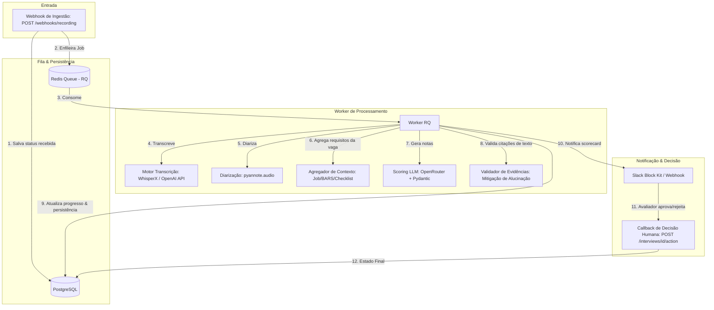

# Pipeline de Scorecard de Entrevistas com IA

[](https://github.com/luccapinto/scorecard-pipeline)
[](https://www.python.org/)
[](https://opensource.org/licenses/MIT)

Este é um projeto de portfólio open-source focado no processamento assíncrono e orientado a eventos de gravações de entrevistas de recrutamento. Ele realiza a **transcrição multi-falante (STT)**, **diarização (quem falou o quê)**, **avaliação automatizada por competências (scorecards baseados na escala BARS)** via LLMs e envia o resultado para aprovação humana final (**Human-in-the-loop**).

---

## 🏗️ Arquitetura do Sistema

O pipeline é projetado para processar cada gravação de entrevista individualmente, sem polling periódico e sem loteamento.



---

## 🛠️ Stack Tecnológica

- **Core & API:** Python 3.11 + FastAPI (Uvicorn)
- **Fila de Mensageria:** Redis + RQ (Redis Queue)
- **Persistência de Estado:** PostgreSQL (SQLAlchemy / SQLModel)
- **Transcrição (STT):** WhisperX (Local) / OpenAI API (Nuvem)
- **Diarização (Speakers):** Pyannote.audio (`pyannote/speaker-diarization-3.1`)
- **Motor de Scoring:** OpenRouter (Model-agnostic via JSON estruturado Pydantic)
- **Geração de Dados Sintéticos:** `edge-tts` (TTS multi-voz Azure) + Templates de Vaga estruturados
- **Notificações:** Slack Webhook (Block Kit) + Webhook Genérico HTTP
- **Containerização:** Docker + Docker Compose

---

## 📖 Decisões de Arquitetura (ADRs)

Documentamos detalhadamente as principais escolhas técnicas do projeto através de Architecture Decision Records (ADRs):

1. **[ADR 0001 — Fila vs. Polling](docs/adr/0001-fila-vs-polling.md):** Uso de arquitetura orientada a eventos com Redis Queue frente a consultas periódicas.
2. **[ADR 0002 — Lookup Determinístico vs. RAG](docs/adr/0002-lookup-deterministico-vs-rag.md):** Por que optamos por lookup de arquivos locais de vagas em vez de buscas semânticas vetoriais para montagem do prompt.
3. **[ADR 0003 — Escolha de Fila Simples (RQ) vs. Celery](docs/adr/0003-rq-vs-celery.md):** Balanceamento de complexidade e robustez com RQ.
4. **[ADR 0004 — Risco de Viés em Avaliação de Cultura](docs/adr/0004-avaliacao-cultura-fit-bias.md):** Mitigações éticas baseadas em âncoras BARS, evidências literais obrigatórias e validação humana mandate.

---

## 📂 Estrutura de Diretórios

```text
├── app/
│   ├── main.py            # FastAPI Webhooks & endpoints de consulta/callback
│   ├── models.py          # Tabelas SQLAlchemy da Entrevista e máquina de estados
│   ├── database.py        # Conexão e sessão do PostgreSQL / SQLite
│   ├── config.py          # Configurações de variáveis de ambiente (Pydantic Settings)
│   ├── queue.py           # Conexão com Redis Queue
│   ├── tasks.py           # Orquestração resiliente da esteira do Worker
│   ├── audio_processor.py # drivers WhisperX (local), OpenAI (nuvem) e Pyannote
│   ├── scoring.py         # Leitura de contexto, chamada OpenRouter e validador de evidência
│   ├── notifications.py   # Adaptadores Slack Block Kit e Webhook genérico
│   └── schemas.py         # Validação Pydantic (Vagas, checklists e scorecards)
├── data/
│   └── synthetic/         # JSONs de vaga e áudios de teste gerados sinteticamente
├── docs/
│   ├── adr/               # Architecture Decision Records (ADRs)
│   ├── reports/           # Relatório comparativo de Word Error Rate (WER)
│   └── specs/             # Especificações de design SDD (Spec Driven Development)
├── scripts/
│   ├── generate_synthetic.py  # Script CLI gerador de TTS e vaga para testes locais
│   └── run_benchmark.py       # Script CLI comparador de WER local vs OpenAI
├── tests/                 # Suíte completa de testes unitários e de integração (pytest)
├── docker-compose.yml     # PostgreSQL e Redis local
├── requirements.txt       # Dependências do projeto
└── run_worker.py          # Script de inicialização do Worker RQ
```

---

## 🚀 Como Executar Localmente

### 1. Pré-requisitos
- Docker instalado na máquina.
- Python 3.11 instalado localmente.

### 2. Configurando o Ambiente
Copie o arquivo `.env.example` para `.env`:
```bash
cp .env.example .env
```
Preencha as variáveis conforme necessário:
- `HF_TOKEN`: Token do Hugging Face com acesso ao pipeline do `pyannote/speaker-diarization-3.1`.
- `OPENROUTER_API_KEY` ou `OPENAI_API_KEY`: Chaves de API para os modelos de Scoring e Transcrição em nuvem.
- `SLACK_WEBHOOK_URL` (Opcional): Para testar notificações no Slack.

### 3. Subindo a Infraestrutura (Postgres + Redis)
Inicie os serviços do banco e fila em background:
```bash
docker compose up -d
```

### 4. Instalando Dependências Locais
Crie um ambiente virtual e instale as dependências:
```bash
python -m venv .venv
# Ativar ambiente virtual
# No Windows:
.venv\Scripts\activate
# No Linux/MacOS:
source .venv/bin/activate

pip install -r requirements.txt
```

### 5. Gerando os Dados Sintéticos de Teste
Para simular o pipeline, gere arquivos de áudio multi-voz com termos em inglês e o contexto da vaga:
```bash
python scripts/generate_synthetic.py
```
Esse comando irá criar arquivos de áudio `.wav` e metadados JSON na pasta `data/synthetic/`.

### 6. Executando o Worker RQ e o Servidor Web
Abra dois terminais (com o ambiente virtual ativo) para subir o Worker e a API:

**Terminal 1 (Worker):**
```bash
python run_worker.py
```

**Terminal 2 (API FastAPI):**
```bash
python -m uvicorn app.main:app --reload
```

---

## 🧪 Validando o Fluxo de Ponta a Ponta

### 1. Disparando a Ingestão (Webhook)
Envie uma requisição simulando que a gravação da entrevista está pronta para processamento assíncrono:
```bash
curl -X POST http://127.0.0.1:8000/webhooks/recording \
  -H "Content-Type: application/json" \
  -d '{
    "recording_url": "data/synthetic/interview_python_pleno.wav",
    "job_id": "python_pleno"
  }'
```
O webhook retornará HTTP `202 Accepted` contendo o ID da entrevista gerado. O worker iniciará imediatamente o processamento (transcrição → diarização → scoring → notificação).

### 2. Consultando o Status da Entrevista
Consulte o andamento do processamento:
```bash
curl http://127.0.0.1:8000/interviews/{INTERVIEW_ID}
```
Assim que o status atingir `aguardando_aprovacao`, a notificação de exemplo (Slack ou Webhook) terá sido disparada e o scorecard estará persistido.

### 3. Simulando a Decisão Humana (Callback)
Aprove o scorecard e finalize o processamento:
```bash
curl -X POST http://127.0.0.1:8000/interviews/{INTERVIEW_ID}/action \
  -H "Content-Type: application/json" \
  -d '{
    "action": "approve"
  }'
```
Isso atualizará o estado final da entrevista no PostgreSQL para `aprovada`.

---

## 📊 Relatório de Benchmark WER

Para avaliar a taxa de erro de palavra (WER) no code-switching PT-EN entre a transcrição local (WhisperX) e nuvem (OpenAI API), execute o script de benchmark:
```bash
python scripts/run_benchmark.py
```
O resultado consolidado e a análise qualitativa detalhada serão salvos em `docs/reports/benchmark_wer_report.md`.

---

## 🩺 Executando a Suíte de Testes

Os testes validam de forma unitária e de integração todas as etapas do sistema, simulando resiliência de rede e interrupções inesperadas de worker. Para executá-los:
```bash
# Configurando o PYTHONPATH no Windows PowerShell:
$env:PYTHONPATH="."
.venv\Scripts\pytest -v

# No Linux/MacOS:
PYTHONPATH=. pytest -v
```
