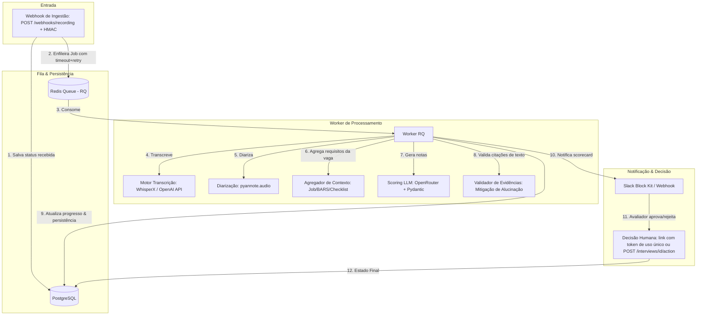

# Pipeline de Scorecard de Entrevistas com IA

[](https://github.com/luccapinto/scorecard-pipeline/actions/workflows/ci.yml)
[](https://www.python.org/)
[](https://opensource.org/licenses/MIT)

## 🏗️ Arquitetura do Sistema

O pipeline é projetado para processar cada gravação de entrevista individualmente, sem polling periódico e sem loteamento.



### Máquina de Estados

```
recebida → transcrevendo → diarizando → pontuando → aguardando_aprovacao → aprovada | rejeitada
                 ↘             ↘            ↘
                              falhou  (reprocessável via POST /interviews/{id}/reprocess)
```

Cada etapa persiste um checkpoint (`transcription_raw`, `diarization_raw`, `scorecard`);
uma entrevista que falhou retoma exatamente do ponto onde parou, sem repetir
transcrição/diarização já concluídas. Jobs são enfileirados com `job_timeout`
dimensionado para áudios longos e retry automático com backoff.

---

## 🛠️ Stack Tecnológica

- **Core & API:** Python 3.11 + FastAPI (Uvicorn)
- **Fila de Mensageria:** Redis + RQ (Redis Queue) com timeout e retries configurados
- **Persistência de Estado:** PostgreSQL (SQLAlchemy / SQLModel, JSONB) + Alembic (migrações)
- **Transcrição (STT):** WhisperX (Local) / OpenAI API (Nuvem)
- **Diarização (Speakers):** Pyannote.audio (`pyannote/speaker-diarization-3.1`)
- **Motor de Scoring:** OpenRouter (structured outputs JSON Schema derivado de Pydantic, `temperature=0`)
- **Validação de Evidência:** matching exato + fuzzy (RapidFuzz) tolerante a WER real
- **Geração de Dados Sintéticos:** `edge-tts` (TTS multi-voz Azure) + Templates de Vaga estruturados
- **Notificações:** Slack Webhook (Block Kit) com links de decisão por token de uso único + Webhook Genérico HTTP
- **Segurança:** HMAC no webhook de ingestão, API key nos endpoints, guarda anti-SSRF no download de áudio
- **Containerização:** Docker + Docker Compose (API + worker + Postgres + Redis)

---

## 📖 Decisões de Arquitetura (ADRs)

Documentamos detalhadamente as principais escolhas técnicas do projeto através de Architecture Decision Records (ADRs):

1. **[ADR 0001 — Fila vs. Polling](docs/adr/0001-fila-vs-polling.md):** Uso de arquitetura orientada a eventos com Redis Queue frente a consultas periódicas.
2. **[ADR 0002 — Lookup Determinístico vs. RAG](docs/adr/0002-lookup-deterministico-vs-rag.md):** Por que optamos por lookup de arquivos locais de vagas em vez de buscas semânticas vetoriais para montagem do prompt.
3. **[ADR 0003 — Escolha de Fila Simples (RQ) vs. Celery](docs/adr/0003-rq-vs-celery.md):** Balanceamento de complexidade e robustez com RQ.
4. **[ADR 0004 — Risco de Viés em Avaliação de Cultura](docs/adr/0004-avaliacao-cultura-fit-bias.md):** Mitigações éticas baseadas em âncoras BARS, evidências literais obrigatórias e validação humana mandate.

Há também uma revisão completa de arquitetura em [docs/reviews/](docs/reviews/).

---

## 📂 Estrutura de Diretórios

```text
├── app/
│   ├── main.py            # FastAPI Webhooks, decisão humana, health e admin
│   ├── models.py          # Tabela Interview e máquina de estados (inclui FALHOU)
│   ├── database.py        # Conexão e sessão do PostgreSQL / SQLite
│   ├── config.py          # Configurações de variáveis de ambiente (Pydantic Settings)
│   ├── queue.py           # Conexão com Redis Queue + política de timeout/retry
│   ├── tasks.py           # Orquestração resiliente da esteira do Worker (com lock)
│   ├── audio_processor.py # Drivers WhisperX (local), OpenAI (nuvem) e Pyannote (com cache de modelos)
│   ├── scoring.py         # Contexto, OpenRouter (structured outputs) e validador de evidência fuzzy
│   ├── notifications.py   # Slack Block Kit e Webhook genérico com links de decisão por token
│   ├── security.py        # Verificação HMAC do webhook e API key
│   ├── maintenance.py     # Reconciliação de entrevistas órfãs e retenção (LGPD)
│   ├── logging_config.py  # Logging estruturado com correlation id (interview_id)
│   ├── text_utils.py      # Normalização de texto compartilhada
│   └── schemas.py         # Validação Pydantic (Vagas, checklists e scorecards)
├── alembic/               # Migrações de schema versionadas
├── data/
│   └── synthetic/         # JSONs de vaga e áudios de teste gerados sinteticamente
├── docs/
│   ├── adr/               # Architecture Decision Records (ADRs)
│   ├── reports/           # Relatório comparativo de Word Error Rate (WER)
│   ├── reviews/           # Revisões de arquitetura
│   └── specs/             # Especificações de design SDD (Spec Driven Development)
├── scripts/
│   ├── generate_synthetic.py  # Script CLI gerador de TTS e vaga para testes locais
│   └── run_benchmark.py       # Script CLI comparador de WER local vs OpenAI
├── tests/                 # Suíte de testes (pytest)
├── Dockerfile             # Imagem da API e do worker
├── docker-compose.yml     # Stack completa: Postgres, Redis, API e worker
├── requirements.txt       # Dependências de produção
├── requirements-dev.txt   # Dependências de desenvolvimento/teste
├── requirements-ml.txt    # Backends ML pesados (WhisperX, pyannote)
└── run_worker.py          # Worker RQ com validação fail-fast de dependências
```

---

## 🚀 Como Executar Localmente

### 1. Pré-requisitos
- Docker instalado na máquina.
- Python 3.11 instalado localmente.

### 2. Configurando o Ambiente
Copie o arquivo `.env.example` para `.env`:
```bash
cp .env.example .env
```
Preencha as variáveis conforme necessário:
- `HF_TOKEN`: Token do Hugging Face com acesso ao pipeline do `pyannote/speaker-diarization-3.1`.
- `OPENROUTER_API_KEY` ou `OPENAI_API_KEY`: Chaves de API para os modelos de Scoring e Transcrição em nuvem.
- `SLACK_WEBHOOK_URL` (Opcional): Para testar notificações no Slack.
- **Em produção, sempre defina:** `WEBHOOK_HMAC_SECRET` (assinatura do webhook), `API_KEY` (auth dos endpoints) e `AUDIO_ALLOWED_DIR` (restringe caminhos locais de áudio).

### 3. Opção A — Stack completa com Docker Compose
```bash
docker compose up -d --build
```
Sobe Postgres, Redis, a API (com migrações aplicadas automaticamente) e o worker
(imagem com os backends ML instalados via `INSTALL_ML=true`).

### 3. Opção B — Infra no Docker, app local
```bash
docker compose up -d postgres redis
python -m venv .venv && source .venv/bin/activate
pip install -r requirements-dev.txt
# Backends ML locais (WhisperX + pyannote — pesado, requer torch):
pip install -r requirements-ml.txt
```

### 4. Aplicando as Migrações de Banco
O schema é gerenciado pelo Alembic (a API não cria tabelas no startup):
```bash
alembic upgrade head
```

### 5. Gerando os Dados Sintéticos de Teste
```bash
python scripts/generate_synthetic.py
```
Esse comando irá criar arquivos de áudio `.wav` e metadados JSON na pasta `data/synthetic/`.

### 6. Executando o Worker RQ e o Servidor Web
Abra dois terminais (com o ambiente virtual ativo):

**Terminal 1 (Worker):**
```bash
python run_worker.py
```
O worker valida na inicialização que o provider configurado é executável
(whisperx/pyannote instalados, chaves definidas) e falha imediatamente com uma
mensagem clara caso contrário — nunca processa com dados simulados.

**Terminal 2 (API FastAPI):**
```bash
python -m uvicorn app.main:app --reload
```

---

## 🧪 Validando o Fluxo de Ponta a Ponta

### 1. Disparando a Ingestão (Webhook)
```bash
curl -X POST http://127.0.0.1:8000/webhooks/recording \
  -H "Content-Type: application/json" \
  -d '{
    "recording_url": "data/synthetic/interview_python_pleno.wav",
    "job_id": "python_pleno",
    "external_id": "gravacao-001"
  }'
```
O webhook retorna HTTP `202 Accepted` com o ID da entrevista. `external_id` é a
chave de idempotência: um webhook reenviado com o mesmo valor retorna a
entrevista existente em vez de criar duplicata. Com `WEBHOOK_HMAC_SECRET`
definido, envie também o header `X-Webhook-Signature` (HMAC-SHA256 do corpo).

### 2. Consultando o Status da Entrevista
```bash
curl -H "X-API-Key: $API_KEY" http://127.0.0.1:8000/interviews/{INTERVIEW_ID}
```
Assim que o status atingir `aguardando_aprovacao`, a notificação terá sido
disparada com links de decisão de uso único. Se o processamento falhar, o
status fica `falhou` com o erro em `error_log`.

### 3. Decisão Humana
Pelos botões da notificação (link GET com token de uso único), ou via API:
```bash
curl -X POST http://127.0.0.1:8000/interviews/{INTERVIEW_ID}/action \
  -H "Content-Type: application/json" -H "X-API-Key: $API_KEY" \
  -d '{"action": "approve"}'
```

### 4. Operação
```bash
curl http://127.0.0.1:8000/health                                  # liveness de DB e Redis
curl -X POST -H "X-API-Key: $API_KEY" \
  http://127.0.0.1:8000/interviews/{INTERVIEW_ID}/reprocess        # reprocessa entrevista 'falhou'
curl -X POST -H "X-API-Key: $API_KEY" \
  http://127.0.0.1:8000/admin/reconcile                            # re-enfileira 'recebida' órfãs
python -m app.maintenance                                          # reconciliação + retenção via cron
```

---

## 📊 Relatório de Benchmark WER

Para avaliar a taxa de erro de palavra (WER) no code-switching PT-EN entre a transcrição local (WhisperX) e nuvem (OpenAI API), execute o script de benchmark:
```bash
python scripts/run_benchmark.py
```
O resultado será salvo em `docs/reports/benchmark_wer_report.md`. Quando um dos
motores não está disponível (whisperx ausente ou `OPENAI_API_KEY` indefinida), o
relatório marca as linhas correspondentes como **SIMULADO (mock)** — esses
números exercitam o pipeline do relatório, mas não medem acurácia real.

---

## 🩺 Executando a Suíte de Testes

```bash
# Lint
ruff check .

# Testes com cobertura
PYTHONPATH=. pytest --cov=app -v
```
