# AI Interview Scorecard Pipeline

[](https://github.com/luccapinto/scorecard-pipeline/actions/workflows/ci.yml)
[](https://www.python.org/)
[](https://opensource.org/licenses/MIT)
[](https://github.com/luccapinto/scorecard-pipeline/actions/workflows/codeql.yml)

Turns a technical interview recording into a **structured scorecard based on
verified evidence**. Every quote used to justify a score is checked against the
transcript (exact + fuzzy matching) before it reaches a human — and the final
decision is **always human**: the pipeline stops at `aguardando_aprovacao` and
never approves or rejects a candidate on its own.

Transcription and speaker diarization have a **dual architecture**: they run
entirely **locally** (WhisperX + pyannote, without sending audio to third
parties) or **via API** (Deepgram nova-3, the default — one call handles both
steps). Switching is an environment variable; the pipeline, the state machine and the scoring do not change.

## 📑 Table of Contents

- [System Architecture](#%EF%B8%8F-system-architecture)
- [Technology Stack](#%EF%B8%8F-technology-stack)
- [Architecture Decisions (ADRs)](#-architecture-decisions-adrs)
- [Directory Structure](#-directory-structure)
- [Running Locally](#-running-locally)
- [Web Interface](#%EF%B8%8F-web-interface)
- [Validating the End-to-End Flow](#-validating-the-end-to-end-flow)
- [Transcription & Speaker Diarization — Providers](#%EF%B8%8F-transcription--speaker-diarization--providers)
- [WER Benchmark](#-wer-benchmark-report)
- [Tests](#-running-the-test-suite)
- [Contributing](#-contributing)
- [License](#-license)

## 🏗️ System Architecture

The pipeline is designed to process each interview recording individually, with no periodic polling and no batching.

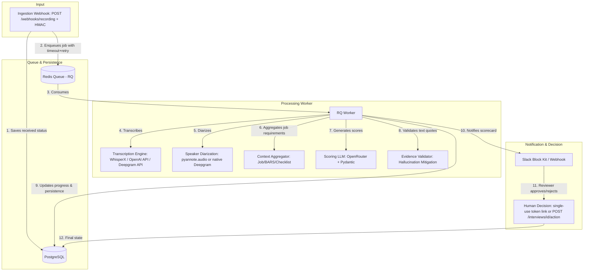
```mermaid
flowchart TD
    subgraph Input
        Webhook[Ingestion Webhook: POST /webhooks/recording + HMAC]
    end

    subgraph Queue & Persistence
        Redis[(Redis Queue - RQ)]
        Postgres[(PostgreSQL)]
    end

    subgraph Processing Worker
        Worker[RQ Worker]
        Transcribe[Transcription Engine: WhisperX / OpenAI API / Deepgram API]
        Diarize[Speaker Diarization: pyannote.audio or native Deepgram]
        Context[Context Aggregator: Job/BARS/Checklist]
        LLM[Scoring LLM: OpenRouter + Pydantic]
        Validator[Evidence Validator: Hallucination Mitigation]
    end

    subgraph Notification & Decision
        Slack[Slack Block Kit / Webhook]
        Approver[Human Decision: single-use token link or POST /interviews/id/action]
    end

    Webhook -->|1. Saves received status| Postgres
    Webhook -->|2. Enqueues job with timeout+retry| Redis
    Redis -->|3. Consumes| Worker
    Worker -->|4. Transcribes| Transcribe
    Worker -->|5. Diarizes| Diarize
    Worker -->|6. Aggregates job requirements| Context
    Worker -->|7. Generates scores| LLM
    Worker -->|8. Validates text quotes| Validator
    Worker -->|9. Updates progress & persistence| Postgres
    Worker -->|10. Notifies scorecard| Slack
    Slack -->|11. Reviewer approves/rejects| Approver
    Approver -->|12. Final state| Postgres
```

### State Machine

```
recebida → transcrevendo → diarizando → pontuando → aguardando_aprovacao → aprovada | rejeitada
                 ↘             ↘            ↘
                              falhou  (reprocessable via POST /interviews/{id}/reprocess)
```

Each step persists a checkpoint (`transcription_raw`, `diarization_raw`,
`scorecard`); an interview that failed resumes exactly where it stopped,
without repeating transcription/diarization already completed. Jobs are
enqueued with `job_timeout` sized for long audio and automatic retry with
backoff.

### Dual architecture: transcription and speaker diarization

The `TRANSCREVENDO` and `DIARIZANDO` steps are the same in the state machine,
but the internal work depends on the `TRANSCRIPTION_PROVIDER`:

> **Read the diagrams like this:** `TRANSCREVENDO` and `DIARIZANDO` (in the
> top lanes) are **pipeline states**, persisted in Postgres — not work. They
> exist equally in both modes; what changes is what runs inside each one, shown
> in the bottom lane. Keeping the same states is intentional: the resume
> checkpoint, the status exposed by the API and the contract read by the
> scoring do not depend on the chosen provider.

**API mode (`deepgram`, default)** — a single call resolves transcription and
diarization. The interview **still passes through the `DIARIZANDO` state**,
but no model runs and no new call is made there: the speakers are already in
the segments, and the step merely records them into `diarization_raw`. No
local models, no GPU, no `HF_TOKEN`:

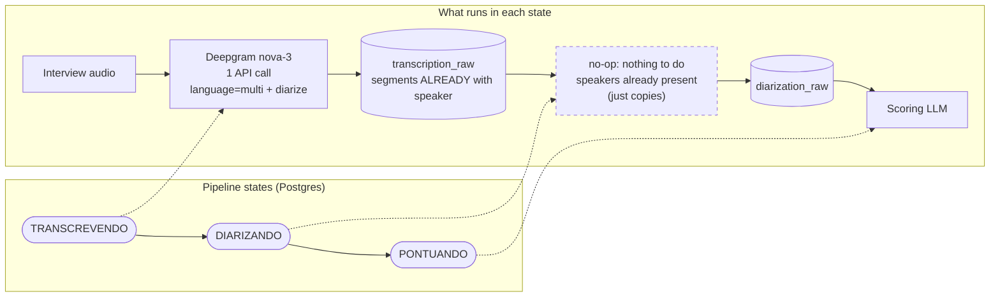
```mermaid
flowchart LR
    subgraph estados ["Pipeline states (Postgres)"]
        direction LR
        S1([TRANSCREVENDO]) --> S2([DIARIZANDO]) --> S3([PONTUANDO])
    end

    subgraph trabalho ["What runs in each state"]
        direction LR
        Audio[Interview audio] --> DG["Deepgram nova-3<br/>1 API call<br/>language=multi + diarize"]
        DG --> TR[("transcription_raw<br/>segments ALREADY with speaker")]
        TR --> NOOP["no-op: nothing to do<br/>speakers already present<br/>(just copies)"]
        NOOP --> DR[("diarization_raw")]
        DR --> Scoring[Scoring LLM]
    end

    S1 -.-> DG
    S2 -.-> NOOP
    S3 -.-> Scoring

    style NOOP stroke-dasharray: 5 5
```

**Local mode (`local`)** — everything runs on your infrastructure; no audio
leaves it. Here the `DIARIZANDO` state does real work: pyannote detects the
speakers and a timestamp-overlap merge assigns each utterance:

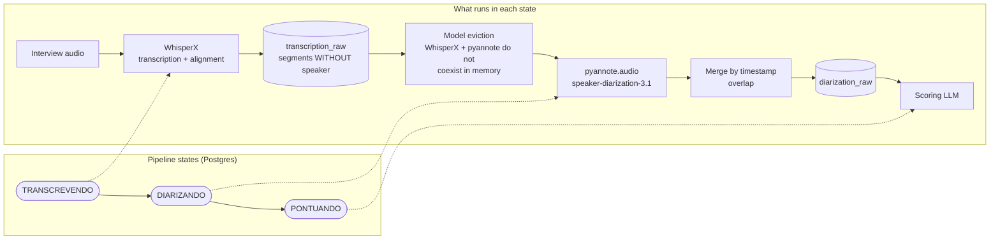
```mermaid
flowchart LR
    subgraph estados ["Pipeline states (Postgres)"]
        direction LR
        S1([TRANSCREVENDO]) --> S2([DIARIZANDO]) --> S3([PONTUANDO])
    end

    subgraph trabalho ["What runs in each state"]
        direction LR
        Audio[Interview audio] --> WX["WhisperX<br/>transcription + alignment"]
        WX --> TR[("transcription_raw<br/>segments WITHOUT speaker")]
        TR --> GC["Model eviction<br/>WhisperX + pyannote do not<br/>coexist in memory"]
        GC --> PY["pyannote.audio<br/>speaker-diarization-3.1"]
        PY --> MG["Merge by timestamp<br/>overlap"]
        MG --> DR[("diarization_raw")]
        DR --> Scoring[Scoring LLM]
    end

    S1 -.-> WX
    S2 -.-> PY
    S3 -.-> Scoring
```

**Why doesn't API mode skip the state?** Because the states are the pipeline's
durability mechanism, and keeping them identical across providers gives three
things: an interview that failed resumes from `DIARIZANDO` and finds
`diarization_raw` already persisted, regardless of who produced it; the status
exposed by the API does not leak which provider is configured; and the scoring
always reads `diarization_raw`, with no alternative path. The cost is a data
duplication in API mode (`transcription_raw` and `diarization_raw` end up
nearly identical) — cheap for the volume of a single interview, and the price of maintaining one pipeline instead of two.

The no-op decision is made **from the persisted data** (segments that already
carry the `speaker` key), not from the current configuration — an interview
resumed after a provider switch keeps behaving correctly. Compare cost, time
and requirements of each mode in the
[Transcription & Speaker Diarization](#%EF%B8%8F-transcription--speaker-diarization--providers) section.

---

## 🛠️ Technology Stack

- **Core & API:** Python 3.11 + FastAPI (Uvicorn)
- **Messaging Queue:** Redis + RQ (Redis Queue) with configurable timeout and retries
- **State Persistence:** PostgreSQL (SQLAlchemy / SQLModel, JSONB) + Alembic (migrations)
- **Transcription (STT):** Deepgram nova-3 (Cloud, **default**, with native diarization) / WhisperX (Local) / OpenAI API (Cloud)
- **Speaker Diarization:** native in Deepgram mode (default); Pyannote.audio (`pyannote/speaker-diarization-3.1`) in local/openai modes
- **Scoring Engine:** OpenRouter (structured outputs with a JSON Schema derived from Pydantic, `temperature=0`)
- **Evidence Validation:** exact + fuzzy matching (RapidFuzz) tolerant of real-world WER
- **Synthetic Data Generation:** `edge-tts` (Azure multi-voice TTS) + structured Job Templates
- **Notifications:** Slack Webhook (Block Kit) with single-use token decision links + Generic HTTP Webhook
- **Security:** HMAC on the ingestion webhook, API key on the endpoints, anti-SSRF guard on audio download
- **Containerization:** Docker + Docker Compose (API + worker + Postgres + Redis)

---

## 📖 Architecture Decisions (ADRs)

We document the project's main technical choices in detail through Architecture Decision Records (ADRs):

1. **[ADR 0001 — Queue vs. Polling](docs/adr/0001-fila-vs-polling.md):** Using an event-driven architecture with Redis Queue instead of periodic polling.
2. **[ADR 0002 — Deterministic Lookup vs. RAG](docs/adr/0002-lookup-deterministico-vs-rag.md):** Why we chose lookup of local job files over vector-based semantic search for prompt assembly.
3. **[ADR 0003 — Simple Queue (RQ) vs. Celery](docs/adr/0003-rq-vs-celery.md):** Balancing complexity and robustness with RQ.
4. **[ADR 0004 — Bias Risk in Culture Assessment](docs/adr/0004-avaliacao-cultura-fit-bias.md):** Ethical mitigations based on BARS anchors, mandatory literal evidence and mandated human validation.

There is also a full architecture review in [docs/reviews/](docs/reviews/).

---

## 📂 Directory Structure

```text
├── app/
│   ├── main.py            # FastAPI webhooks, human decision, health and admin
│   ├── models.py          # Interview table and state machine (includes FALHOU)
│   ├── database.py        # PostgreSQL / SQLite connection and session
│   ├── config.py          # Environment variable settings (Pydantic Settings)
│   ├── queue.py           # Redis Queue connection + timeout/retry policy
│   ├── tasks.py           # Resilient orchestration of the worker pipeline (with lock)
│   ├── audio_processor.py # WhisperX (local), OpenAI and Deepgram (cloud) and Pyannote drivers (with model cache)
│   ├── scoring.py         # Context, OpenRouter (structured outputs) and fuzzy evidence validator
│   ├── notifications.py   # Slack Block Kit and generic webhook with token-based decision links
│   ├── security.py        # Webhook HMAC verification and API key
│   ├── maintenance.py     # Reconciliation of orphan interviews and retention (LGPD)
│   ├── logging_config.py  # Structured logging with correlation id (interview_id)
│   ├── text_utils.py      # Shared text normalization
│   └── schemas.py         # Pydantic validation (Jobs, checklists and scorecards)
├── alembic/               # Versioned schema migrations
├── data/
│   └── synthetic/         # Job JSONs and synthetically generated test audio
├── docs/
│   ├── adr/               # Architecture Decision Records (ADRs)
│   ├── reports/           # Comparative Word Error Rate (WER) report
│   ├── reviews/           # Architecture reviews
│   └── specs/             # SDD design specifications (Spec Driven Development)
├── scripts/
│   ├── generate_synthetic.py  # CLI script that generates TTS and a job for local tests
│   └── run_benchmark.py       # CLI script comparing WER across providers
├── tests/                 # Test suite (pytest)
├── Dockerfile             # API and worker image
├── docker-compose.yml     # Full stack: Postgres, Redis, API and worker
├── requirements.txt       # Production dependencies
├── requirements-dev.txt   # Development/test dependencies
├── requirements-ml.txt    # Heavy ML backends (WhisperX, pyannote)
└── run_worker.py          # RQ worker with fail-fast dependency validation
```

---

## 🚀 Running Locally

### 1. Prerequisites
- Docker installed on your machine.
- Python 3.11 installed locally.

### 2. Setting Up the Environment
Copy the `.env.example` file to `.env`:
```bash
cp .env.example .env
```
Fill in the variables as needed:
- `DEEPGRAM_API_KEY`: Deepgram key for the default transcription + diarization provider (nova-3). See the *Transcription & Speaker Diarization* section below.
- `OPENROUTER_API_KEY`: Key for the Scoring engine (LLM).
- `HF_TOKEN`: Hugging Face token with access to `pyannote/speaker-diarization-3.1` — **only** for the `local`/`openai` providers.
- `OPENAI_API_KEY`: only for `TRANSCRIPTION_PROVIDER=openai`.
- `SLACK_WEBHOOK_URL` (Optional): To test Slack notifications.
- **In production, always set:** `WEBHOOK_HMAC_SECRET` (webhook signature), `API_KEY` (endpoint auth) and `AUDIO_ALLOWED_DIR` (restricts local audio paths).

### 3. Option A — Full stack with Docker Compose
```bash
docker compose up -d --build
```
Starts Postgres, Redis, the API (with migrations applied automatically) and the worker
(image with ML backends installed via `INSTALL_ML=true`).

### 3. Option B — Infra in Docker, app locally
```bash
docker compose up -d postgres redis
python -m venv .venv && source .venv/bin/activate
pip install -r requirements-dev.txt
# Local ML backends (WhisperX + pyannote — heavy, requires torch):
pip install -r requirements-ml.txt
```

### 4. Applying Database Migrations
The schema is managed by Alembic (the API does not create tables at startup):
```bash
alembic upgrade head
```

### 5. Synthetic Test Dataset
The repository already includes, in `data/synthetic/`, the JSON files (job, BARS
competencies, checklist and dialogue script) for **three realistic interview
profiles**, covering the whole evaluation spectrum:

| Profile | Job | Candidate | Expected outcome |
|---|---|---|---|
| `python_pleno` | Mid-level Python Developer | Strong (concrete metrics, real incident, good practices) | Approved |
| `dados_senior` | Senior Data Engineer | Mixed (strong on pipelines/Spark, weak on streaming) | Next Step |
| `frontend_junior` | Junior Frontend (React) | Weak (vague answers, confused concepts) | Rejected |

To generate the multi-voice `.wav` audio files (requires internet access for the TTS):
```bash
python scripts/generate_synthetic.py                       # all profiles
python scripts/generate_synthetic.py --profile dados_senior  # a specific profile
python scripts/generate_synthetic.py --skip-audio          # only regenerate the JSONs
```

### 6. Running the RQ Worker and the Web Server
Open two terminals (with the virtual environment active):

**Terminal 1 (Worker):**
```bash
python run_worker.py
```
On startup, the worker validates that the configured provider is runnable
(whisperx/pyannote installed, keys set) and fails immediately with a clear
message otherwise — it never processes with simulated data.

**Terminal 2 (API FastAPI):**
```bash
python -m uvicorn app.main:app --reload
```

---

## 🖥️ Web Interface

The `frontend/` directory holds the **source** of a React 19 + TypeScript SPA.
It is the review surface for the pipeline: where each interview is, what needs
a human, and — the point of the whole system — an unmissable alarm when the
model cited a sentence that is not in the transcript.

> **▶ Try it live, no clone and no backend required:**
> **<https://luccapinto.github.io/scorecard-pipeline/#/demo/esteira>**
>
> That link opens the SPA in **demonstration mode**: a synthetic, deterministic
> dataset that runs entirely in your browser. No request leaves the page, so
> there is nothing to install and nothing to configure.

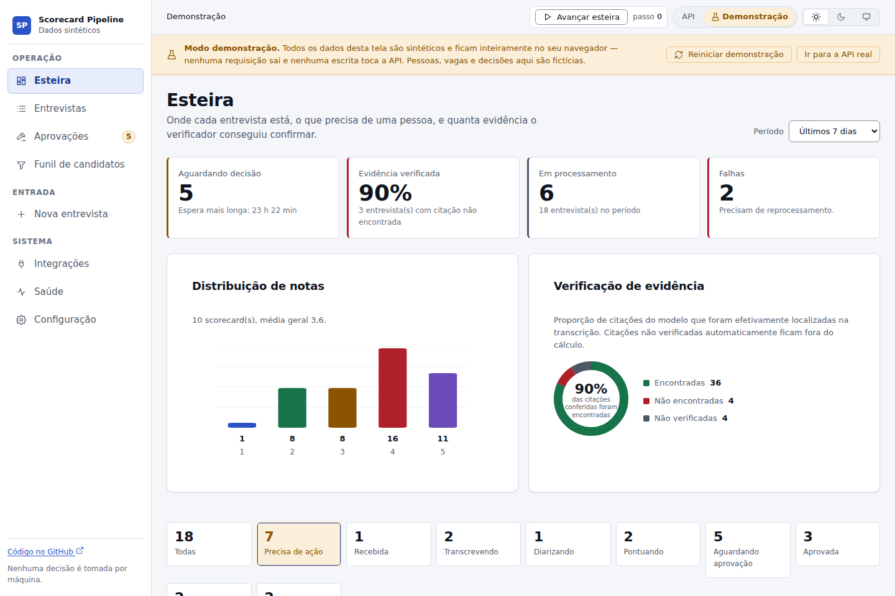

### Two modes, never mixed

The API deliberately does not model a candidate entity, hiring funnel stages,
decision authorship, an audit trail, or message history. Rather than fabricate
those — in a project whose whole subject is *detecting fabrication* — the SPA
runs in two explicit modes, selected in the URL:

- **API mode** (`#/...`) — the real backend, nothing invented. Where the
  contract has no answer, the UI **states the absence** and explains why in one
  line.
- **Demo mode** (`#/demo/...`) — a deterministic synthetic dataset served
  entirely in the browser. **Zero network requests leave the page**, in any
  flow, enforced by a test that drives the real app with every network
  primitive replaced by a throwing spy.

The rationale, the rejected alternatives and the accepted cost are recorded in
[ADR 0005](docs/adr/0005-dois-modos-api-e-demonstracao.md).

Crucially, the hallucination flag is **derived even in the demo**: the client
ports the normalisation rule from `app/text_utils.py::clean_text` and actually
searches the transcript, so a flagged quote is flagged because it genuinely is
not there.

### The screens

#### The scorecard, and the alarm the whole system exists for

Each competency shows its 1–5 score **and the BARS anchor text behind it** —
the number alone means nothing. When a citation cannot be found in the
transcript, the card becomes a loud, structural alert: icon, wording, border
and position, never colour alone. It also shows the closest passage the search
*did* find, so the reviewer can judge rather than just be warned.

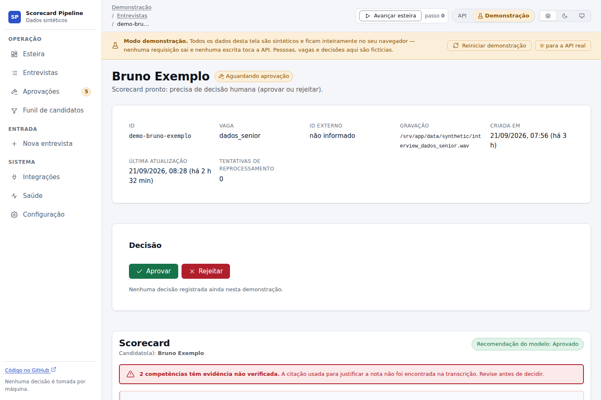

Clicking a citation scrolls to it in the transcript and highlights it in place.

#### The approval queue

Ordered by waiting time, with everything needed to decide visible without
opening the item: role, the model's recommendation, the average score, and how
many citations were actually located. **There is no bulk approval**, by design —
not even in the demo.

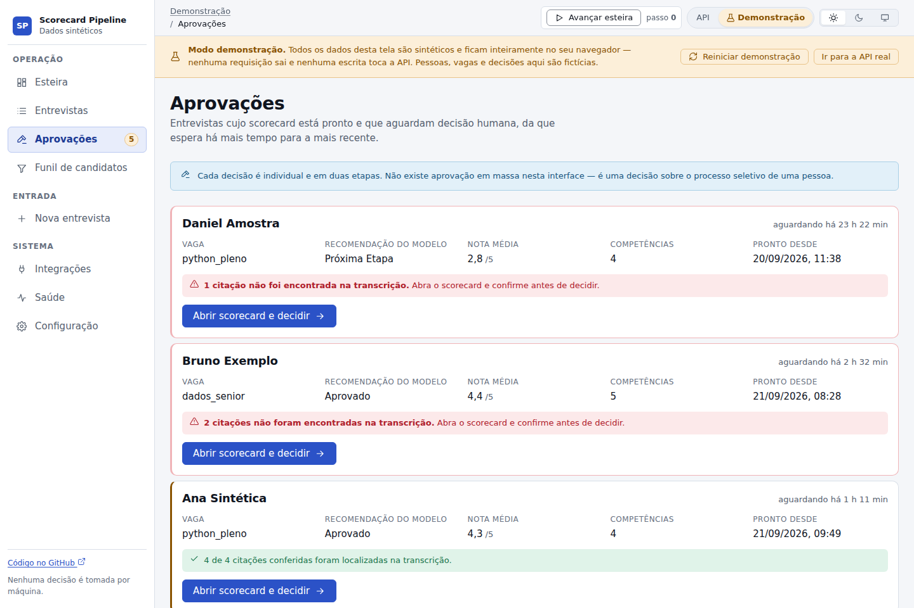

#### Integrations and messages

A faithful rendering of the Slack Block Kit payload `app/notifications.py`
actually builds — including the per-competency verification marker and the
omission of the action buttons when there is no approval token — with the raw
JSON one click away.

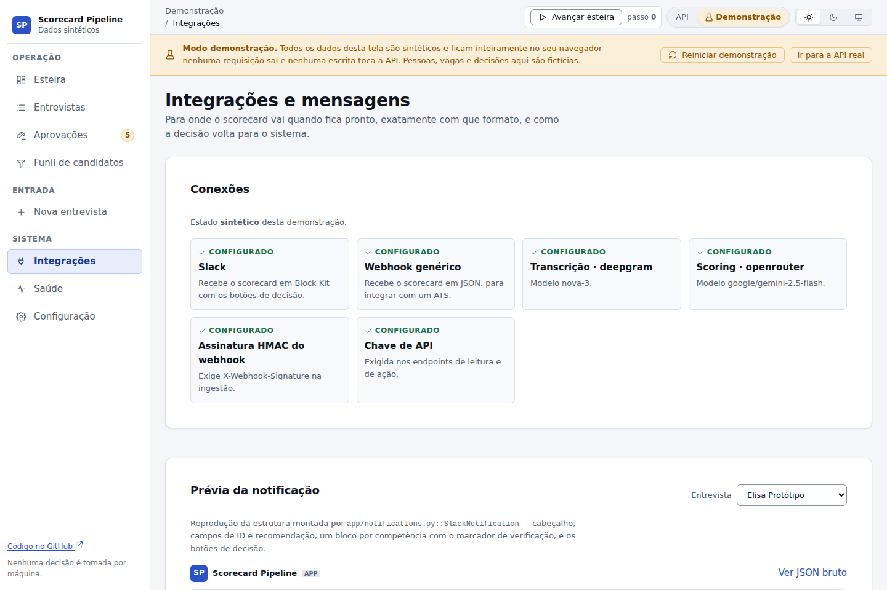

#### The candidate funnel — labelled as synthetic, on the screen

This is the "ATS" view, and it is the clearest example of the honesty rule:
hiring phases do not exist in the backend, so the screen says so in a banner
before showing anything.

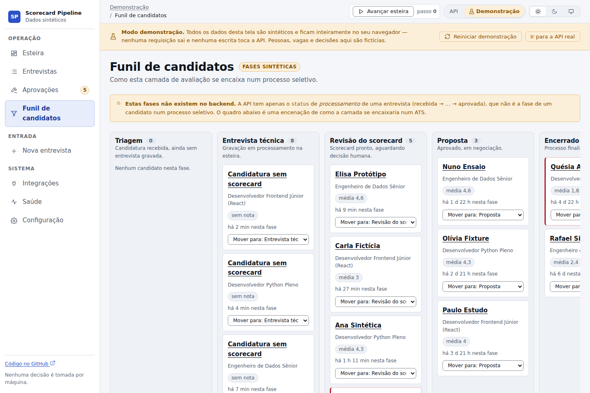

#### Failures, and getting out of them

`error_log` is a full Python traceback. It is split into what broke and where,
with the frames folded away until asked for, plus the reprocess action.

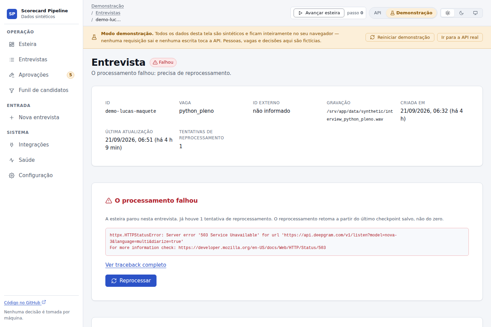

#### Ingestion, with the contract made legible

The exact webhook request, the HMAC signature marked as server-side only,
idempotency via `external_id`, and `202` explained as acceptance rather than
completion.

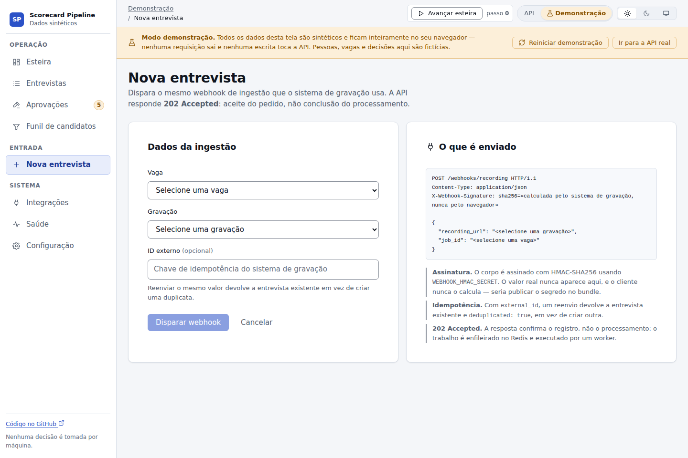

#### Both themes are designed, and it works on a phone

Dark is an independently chosen palette, not a filter over light, and every
colour pair in both themes is checked against WCAG AA in CI.

| Dark theme | Mobile, 390 px |
| --- | --- |
| 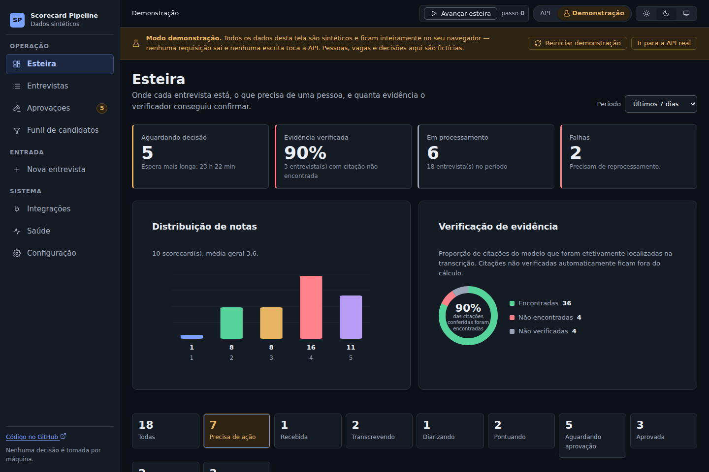 | 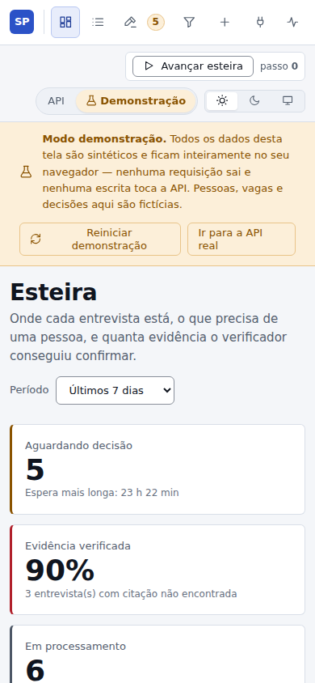 |

More screens — the interview list, observability and settings — are in
[`docs/assets/`](docs/assets/).

All screenshots are generated by `frontend/scripts/screenshots.mjs` from demo
mode, which is deterministic precisely so they can be reproduced on any machine.

### Running it

- **With Docker Compose** the SPA is built from source (multi-stage Node →
  nginx) and served at `http://localhost:5173`, an origin already on the API's
  CORS allowlist.
- **In development**: `cd frontend && npm install && npm run dev` (port 5173 is
  mandatory — the CORS allowlist depends on it).
- **Demo mode needs no backend at all**: open `#/demo/esteira` on any build.
- The API URL and `X-API-Key` are configured **at runtime** in the UI itself
  (persisted in the browser's `localStorage`) — no key or host is baked into
  the build. The key never appears in a log, a URL or an error message.
- How to run, build and test: see [`frontend/README.md`](frontend/README.md).

### Quality gates

Enforced by the `frontend` CI job: TypeScript `strict`, **260 tests**
(Vitest + Testing Library), a WCAG AA contrast check over the design tokens in
both themes, an **axe-core audit across 10 screens × 2 themes**, and a
**≤ 180 KB gzipped** initial-load budget (currently ~99 KB; the demo dataset is
a separate chunk that API-mode users never download). Runtime dependencies:
`react` and `react-dom`, and nothing else.

---

## 🧪 Validating the End-to-End Flow

### 1. Triggering Ingestion (Webhook)
```bash
curl -X POST http://127.0.0.1:8000/webhooks/recording \
  -H "Content-Type: application/json" \
  -d '{
    "recording_url": "data/synthetic/interview_python_pleno.wav",
    "job_id": "python_pleno",
    "external_id": "gravacao-001"
  }'
```
The webhook returns HTTP `202 Accepted` with the interview ID. `external_id` is
the idempotency key: a re-sent webhook with the same value returns the existing
interview instead of creating a duplicate. With `WEBHOOK_HMAC_SECRET` set, also
send the `X-Webhook-Signature` header (HMAC-SHA256 of the body).

### 2. Checking the Interview Status
```bash
curl -H "X-API-Key: *** http://127.0.0.1:8000/interviews/{INTERVIEW_ID}
```
Once the status reaches `aguardando_aprovacao`, the notification will have been
sent with single-use decision links. If processing fails, the status becomes
`falhou` with the error in `error_log`.

### 3. Human Decision
Via the notification buttons (GET link with single-use token), or via the API:
```bash
curl -X POST http://127.0.0.1:8000/interviews/{INTERVIEW_ID}/action \
  -H "Content-Type: application/json" -H "X-API-Key: *** \
  -d '{"action": "approve"}'
```

### 4. Operations
```bash
curl http://127.0.0.1:8000/health                                  # DB and Redis liveness
curl -H "X-API-Key: *** \
  http://127.0.0.1:8000/integrations                               # which integrations are configured
curl -X POST -H "X-API-Key: *** \
  http://127.0.0.1:8000/interviews/{INTERVIEW_ID}/reprocess        # reprocess a 'falhou' interview
curl -X POST -H "X-API-Key: *** \
  http://127.0.0.1:8000/admin/reconcile                            # re-enqueue orphan 'recebida' interviews
python -m app.maintenance                                          # reconciliation + retention via cron
```

`GET /integrations` reports **only** whether each integration (Slack, outbound
webhook, transcription, scoring, HMAC and API key) is configured, plus the
provider/model names in use. It never returns credentials, URLs or paths —
not even masked — so the web interface can render a configuration screen
without turning a read-scoped API key into a credential oracle.

---

## 🎙️ Transcription & Speaker Diarization — Providers

The transcription/diarization step is pluggable via `TRANSCRIPTION_PROVIDER`:

| Provider | Transcription | Speaker Diarization | Requirements | Cost (~1h of audio) | Time (~1h of audio) |
|---|---|---|---|---|---|
| `deepgram` (**default**) | Deepgram nova-3 (API) | **Native, in the same call** | `DEEPGRAM_API_KEY` | ~US$ 0.31 (`multi`) | ~1–2 min |
| `local` | WhisperX (CPU/GPU) | pyannote.audio | `requirements-ml.txt` + `HF_TOKEN` | zero (own compute) | ~15 min+ on CPU |
| `openai` | whisper-1 (API) | pyannote.audio (local) | `OPENAI_API_KEY` + local ML + `HF_TOKEN` | ~US$ 0.36 + compute | hybrid |

In `deepgram` mode, segments already arrive labeled by speaker (`SPEAKER_00`,
`SPEAKER_01`, ... — same format as pyannote) and the pipeline's `DIARIZANDO`
step becomes a passthrough: detection is driven **by the persisted data**
(segments with a `speaker` key), so interviews resumed after a provider switch
behave correctly. In this mode, the worker also skips the whisperx/pyannote/
HF_TOKEN requirements at startup.

**`deepgram` provider gotchas (learned empirically):**
- `DEEPGRAM_LANGUAGE` is required: Deepgram's default is English and, with the
  wrong language, the API returns an **empty** transcript (and still charges).
- Use `multi` (code-switching, this repo's default), not `pt`: the monolingual
  mode drops/mangles the English technical terms embedded in the speech
  ("queries", "deploy", "pull request", "GitHub"...), which are exactly the
  vocabulary the scoring and the evidence validator depend on. `multi` costs
  ~20% more and preserves the vast majority of them.
- OpenRouter has a transcription endpoint (`/api/v1/audio/transcriptions`) that
  serves nova-3, but its normalized schema **drops the speaker labels** — which
  is why the provider talks to the Deepgram API directly.

**Validation with real audio:** the provider was validated against a real
53-minute pt-BR technical interview ([Desenvolvedor Jr | Simulação de entrevista
Técnica — Mate academy Brasil](https://www.youtube.com/live/KPqLBNXewUQ)):
transcription + diarization in 68s (~US$ 0.28), 3 speakers correctly detected
(host, interviewer, candidate) and technical terms (JavaScript, React,
async/await, promises, deploy...) preserved. The audio is **not versioned in
the repository** (third-party content); to reproduce the test, download the
track locally — e.g. with `yt-dlp -f 139 -o entrevista.m4a <url>` — and send
the file through the ingestion webhook like any other recording.

---

## 📊 WER Benchmark Report

Compares the word error rate (WER) and the preservation of technical terms
(PT-EN code-switching) across providers, **actually running them**:

```bash
# All available providers
python scripts/run_benchmark.py

# Or pick which ones to compare
python scripts/run_benchmark.py --providers deepgram local
```

The report is saved to `docs/reports/benchmark_wer_report.md`. Providers
without the required dependency or key configured are listed as **skipped**,
with the reason — the report never contains simulated numbers.

> ⚠️ The audio files in `data/synthetic/*.wav` are **not versioned** (they are
> heavy and regenerable). Generate them before running the benchmark:
> ```bash
> python scripts/generate_synthetic.py
> ```
> A leftover local `.wav` from an old dialogue silently invalidates the WER;
> the script detects this inconsistency and warns you.

---

## 🩺 Running the Test Suite

The same gates applied by CI:

```bash
ruff check .                                    # lint
mypy                                            # type checking
pytest                                          # full suite
pytest --cov=app --cov-report=term-missing --cov-fail-under=78
pip-audit -r requirements.txt --strict          # known vulnerabilities
```

The suite runs **without** the ML backends (`requirements-ml.txt`): the heavy
dependencies are mocked deterministically. The integration tests in
`tests/test_integration_e2e.py` require Postgres and Redis to be up and the
production worker to be stopped — see [CONTRIBUTING.md](CONTRIBUTING.md).

---

## 🤝 Contributing

Contributions are welcome! Read [CONTRIBUTING.md](CONTRIBUTING.md) for the
workflow (Spec Driven Development, branch and commit conventions, local checks)
and the [Code of Conduct](CODE_OF_CONDUCT.md). Large changes start with an
issue; architectural decisions become ADRs in `docs/adr/`.

Security vulnerabilities follow the private process in
[SECURITY.md](SECURITY.md) — never a public issue.

## 📄 License

Distributed under the [MIT](LICENSE) license.
